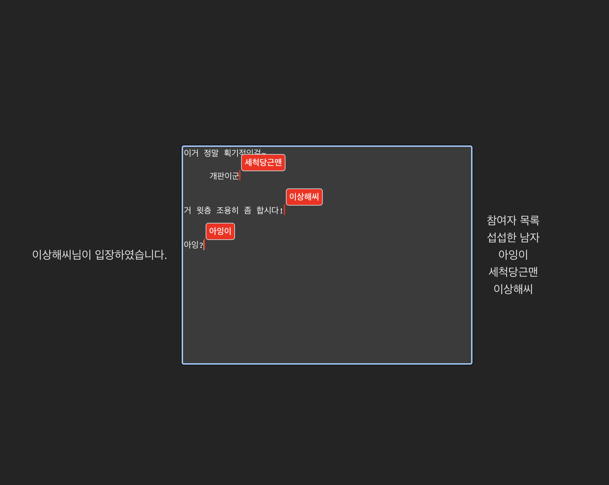

# SIMPLE WEB EDITOR TOY

[demo](https://jarry3369.github.io/BCA-WEB-EDITOR/)

[Broadcast Channel API](https://developer.mozilla.org/en-US/docs/Web/API/Broadcast_Channel_API) 를 사용한 로컬 공동 웹 에디터

그냥 해보고 싶었다..!


bundling with [Vite](https://ko.vitejs.dev/)

## Features

- 하나의 브라우저에서 여러 창(탭)을 통해 텍스트 공동 편집
- 입장 알람 및 세션 참여자 리스트 표시
- 참여자별 이름표 / 입력커서 표시
- 컨텐츠가 켜져 스크롤이 생기면 망가지는 기능

## HOW TO RUN

```
npm install
npm run dev
```
